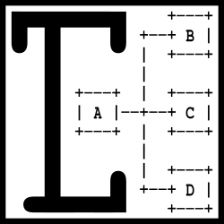
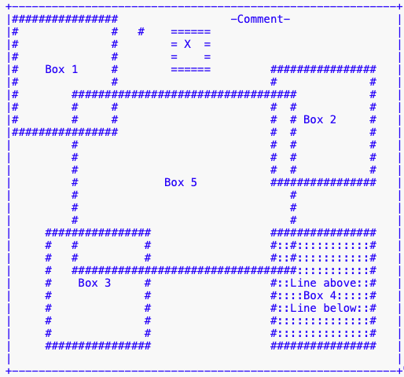
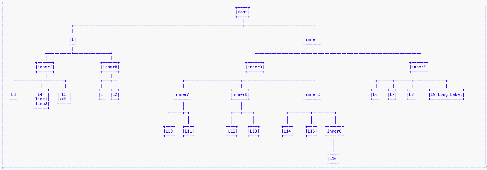
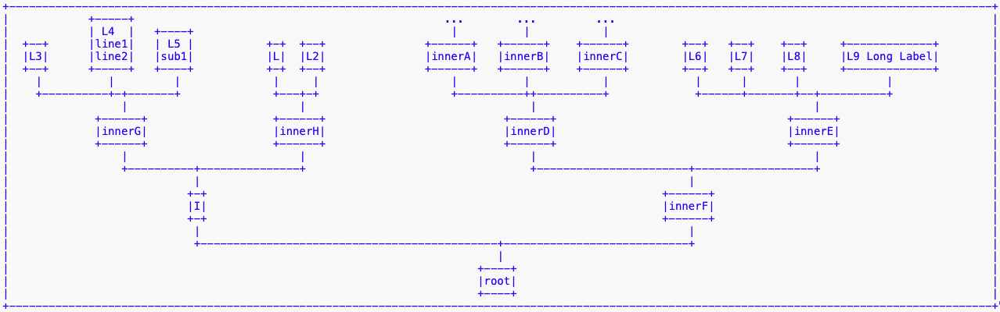
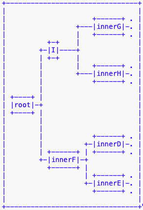
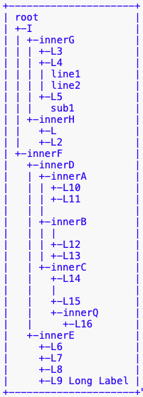

# Text Canvas


This project is a small utility project to quickly print structures in textual form. It allows drawing boxes and connectors using characters into a predefined canvas.

## Build Artifacts

Latest build artifacts can be found on [Maven Central](https://central.sonatype.com/namespace/de.calamanari.tcanv).

```xml
		<dependency>
			<groupId>de.calamanari.tcanv</groupId>
			<artifactId>text-canvas</artifactId>
			<version>1.0.0</version>
		</dependency>
```

## Overview

The motivation for this project came from a recurring annoying task when implementing data structures: every now and then there is the need to get a visual representation for debugging purposes. Often this is only required in the initial phase of a project, and the supplementary (dirty) printing code gets removed once the structure works as desired. Mostly, such code to *quickly output* a data structure is much more complex than initially thought. Hence, I decided to refactor the code from my last exercise into a supplementary project, so that I can reuse it with a few lines of code when I need to (temporarily) add a debug printing feature to some data structure.



Besides the basic features to print (labeled) boxes and lines into a predefined text area ([TextCanvas](src/main/java/de/calamanari/tcanv/TextCanvas.java)), this project provides support for any kind of tree-like data-structure. You only need to implement a single interface ([PrintableTreeNode](src/main/java/de/calamanari/tcanv/tp/PrintableTreeNode.java)) to let the [TreePrinter](src/main/java/de/calamanari/tcanv/tp/TreePrinter.java) iterate over your custom data structure.

 * `getNodeLabel()` returns the current's node label (starting with the root)
 * `getNumberOfSiblings()` must return the number (`n`) of siblings of the current node
 * `getSiblingNode(idx)` must return the corresponding sibling node (`0 .. n-1`)

Out-of-the-box this implementation allows for printing vertical and horizontal as well as index-like diagrams.



 



To get an idea how it works, please refere to the tests included in this project:
 * **[TextCanvasTest](src/test/java/de/calamanari/tcanv/TextCanvasTest.java)** covers the basic features to draw boxes and lines.
 * **[TreePrinterTest](src/test/java/de/calamanari/tcanv/tp/TreePrinterTest.java)** shows how to print a data structure as a vertical or horizontal tree resp. as an index.


 
----


[](https://sonarcloud.io/summary/new_code?id=KarlEilebrecht_text-canvas)


